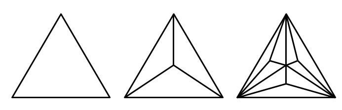
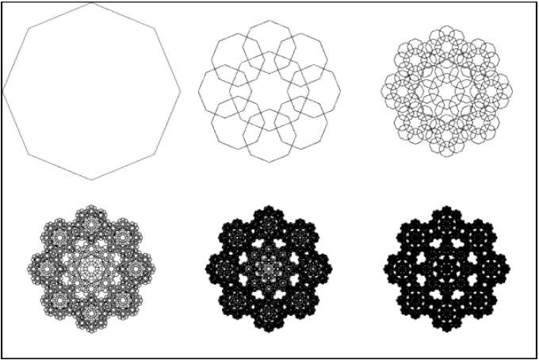
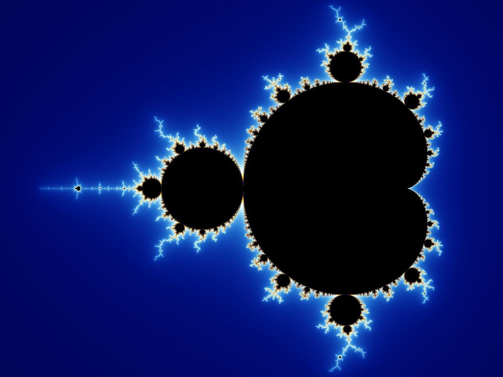

**ALGORITMOS Y ESTRUCTURAS DE DATOS**

 **Guía 2. Gráficos, simulación y recursividad**

Para entregar:

1.  Se pide realizar un programa que permita dibujar tres tipos de
    fractales: 
    
    **A. Triángulo de centro de masa uniforme:**

Este fractal presenta la siguiente dinámica:

1.  Se empieza con un triángulo ubicado en (x,y), cuya base tienen una
    longitud l = lStart y su lados izquierdo y derecho un ángulo
    leftAngle y rightAngle respectivamente medidos desde la base (de 0
    a 90 en el caso derecho y de -90 a 0 en el caso izquierdo). El
    triángulo

2.  Se le agrega al triángulo tres líneas desde sus vértices al centro
    de masa como muestra la figura arriba. Se continúa de esta forma
    por cada nuevo triángulo generado dentro del triángulo original.

3.  La recursión termina cuando el tamaño de alguna de las líneas
    agregadas resulta inferior a cierto valor lEnd.

      **B. Fractal Octogonal:**

Este fractal presenta la siguiente dinámica:

1.  Se empieza con un octógono de longitud de lado l = lStart ubicado en
    (x, y).

2.  Se dibujan ocho octógonos, en cada uno de sus vértices de lado l’
    igual a l multiplicado por una constante = lConstant.

3.  La recursión termina cuando l es inferior a cierto valor lEnd.

       **C. Fractal Mandelbrot:**

Este fractal presenta la siguiente dinámica:

1.  Se toma un campo complejo representado por el plano
    \[a0+jb0; af+jbf\]
    donde el número complejo a0+jb0 representa
    el punto inferior izquierdo del plano y
    af+jbf representa el punto superior derecho
    del plano.

2.  Se toma también una pantalla de tamaño xMax x yMax. De forma que la
    granularidad de la parte real sea gReal =
    (af-a0)/xMax y la granularidad de la parte
    imaginaria sea gImag = (bf-b0)/yMax.

3.  Para cada punto Zi en \[a0+jb0;
    af+jbf\] dadas las granularidades gReal y
    gImag, se evalúa la función:

> fn = (fn-1)^2 + Zi donde
> f0 = 0.

 Iterando hasta Nmax o hasta que la función diverja (se considera que
 la función diverge cuando mod(Fn) no pertenece a la
 circunferencia que se forma con el lado mayor del plano complejo
 definido), lo que ocurra primero. Se toma la profundidad del algoritmo
 como (n-Nmax) donde n representa la cantidad de iteraciones para cada
 Zi. Nótese que para el caso en que la profundidad es 0, el
 punto se considera del conjunto Mandelbrot (ya que no diverge).

 4. Para graficar existen dos posibilidades:

    I.  Se grafican los puntos del conjunto Mandelbrot de negro y el fondo
        de otro color.

    II.  Se corresponde cada pixel con cada punto del plano (mediante
        la granularidad) y para cada punto evaluado se colorea su
        correspondiente pixel según la profundidad arrojada, pintando
        de negro cuando la profundidad es 0 y con algún otro color
        cuando lo profundidad es Nmax, tomando los valores intermedios
        con colores de la gama entre los extremos.

 5. Bibliografía adicional:

        a. *https://en.wikipedia.org/wiki/Mandelbrot\_set*
        
        b. *http://jonisalonen.com/2013/lets-draw-the-mandelbrot-set/*

 **Pautas generales:**

1.  El programa recibe los siguientes parámetros por línea de comandos:
    -type {UNIFORME”, “OCTOGONO”, “MANDELBROT”}

> -lStart (0…100\] -lEnd (0…100). -lConstant (0…1). -leftAngle
> \[-90…90\]. -rightAngle \[-90…90\].
>
> -x0, y0, xf, yf (pueden tomar valores flotantes).

2.  Se deben verificar los parámetros recibidos y validarlos según lo
    que se esté graficando. Por ejemplo, si recibiera especificación de
    ángulos y se desea graficar un fractal OCTOGONO se debe señalar que
    ocurrió un error.

3.  El dibujo del fractal MANDELBROT en “C” fue dibujado con:

> –type MANDELBROT –x0 -2 –y0 -2 –yf 2 –xf 2

4.  Se deberán comprobar los casos límite para asegurar el correcto
    funcionamiento del programa.

5.  Se deberá además jugar con el uso de color en cada iteración.

6.  Como opcional pueden agregarle música mientras se ejecuta
    la recursión.

7.  El grupo que lo desee puede modificar el fractal OCTOGONO para que
    permita dibujar un polígono de N lados. En este caso se deberá
    agregar el parámetro adicional –N a recibir por línea de comandos y
    modificar el –type de OCTOGONO a POLIGONO.

8.  Los parámetros mencionados tanto en “a” como en “g” son
    case insenstive.
